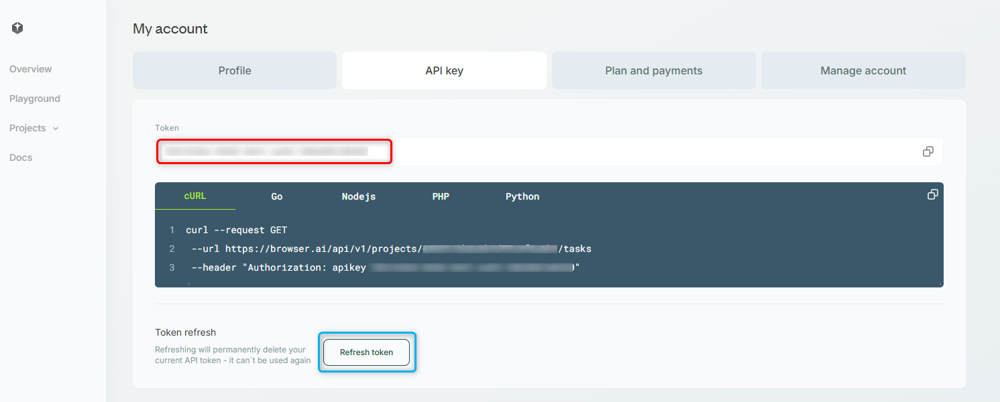

You can find your **API key** by navigating to Dashboard → Account → API Key, or simply click [here](https://browser.ai/dashboard/page/account/tab/api_key).

You’ll see your key right away.
Need a new one? Hit **Refresh Token**, just remember the old key will no longer work!

<Frame>
  
</Frame>