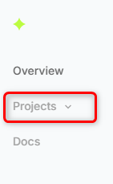
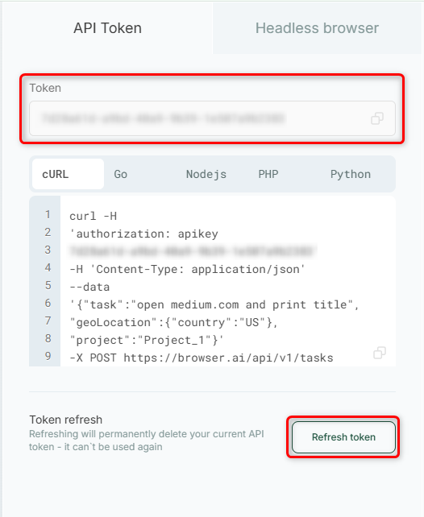

<Steps>
  <Step title="Open dashboard">
    From your [dashboard](https://browser.ai/dashboard), click on **Projects** located on the left sidebar.
    <Frame as="div">
      
    </Frame>
  </Step>
  <Step title="Copy your Token">
    You’ll find your **API token** on the right-hand sidebar, ready for a quick copy-paste. Need a fresh one? Hit that <Tooltip tip="Once you change it, the same key can't be used again">**Refresh token**</Tooltip> button to generate a brand new token on the fly.
    <Frame as="div" style={{width:"80%", height:"auto"}}>
      
    </Frame>
  </Step>
</Steps>