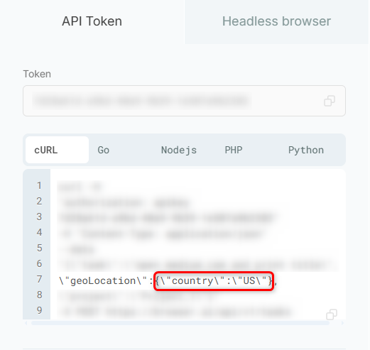

The **Location** parameter allows you to flexibly modify your proxy’s geographic position within a defined country. It’s ideal for collecting region-specific data, testing localized content, and mimicking user activity from different parts of the world. This helps ensure precise data extraction, accurate regional testing, and access to geo-restricted websites.

To change the location in the **API Token tab**, simply update the 2-letter country code within the `{"country":"XX"}` field of the **cURL request** to your desired region.
<Frame>
  
</Frame>