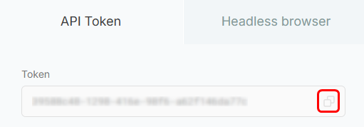
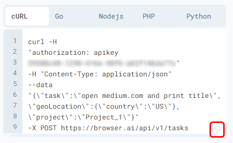

The **BrowserAI** API offers developers a powerful interface to launch, control, and collect output from AI-driven browser automation tasks. Built for flexibility, it allows you to automate web actions, gather content, perform scraping, and execute scripts within a cloud-hosted browser—complete with customizable location targeting.

Ideal for **building data pipelines, automating testing processes, or embedding browser automation into your own applications**, this API delivers a robust, secure, and scalable solution for managing complex web-based workflows with ease.

### API Workflow

1. Start by retrieving your **API key** from the Project Dashboard.
<Frame>
  
</Frame>
2. Create a task by either running the provided **cURL command in CMD** or sending a request to the `/tasks` endpoint with your prompt and location settings.
<Frame>
  
</Frame>
3. If you used the **API endpoint**, you can track the task using the returned `session ID`.
4. You can fetch task **metadata** by calling `/tasks/{session_id}` method and view the response structure similar to this:

```
{
  "executionId": "<string>",
  "scriptId": "<string>",
  "scriptType": "<string>",
  "status": "<string>",
  "progress": {
    "status": "<string>",
    "logs": [
      "<string>"
    ]
  },
  "started": "2023-11-07T05:31:56Z",
  "estimatedCompletion": "2023-11-07T05:31:56Z"
}
```

5. Once completed, retrieve the **final output** by sending a request to the `/results/{session_id}` method and recieve this output:

```
{
  "executionId": "<string>",
  "status": "<string>",
  "started": "2023-11-07T05:31:56Z",
  "completed": "2023-11-07T05:31:56Z",
  "results": [
    {
      "model_output": "<string>",
      "result": "<string>",
      "state": "<string>",
      "metadata": {},
      "history_index": 123,
      "screenshot_url": "<string>",
      "html_url": "<string>",
      "console_url": "<string>",
      "insert_ts": "2023-11-07T05:31:56Z"
    }
  ]
}
```

<Tip>
  Explore more in-depth information about our API [here](https://docs.browser.ai/api-reference/intro)\!
</Tip>