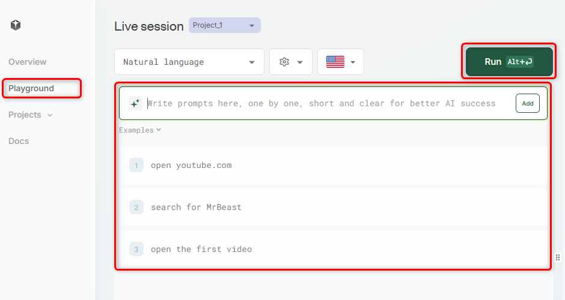
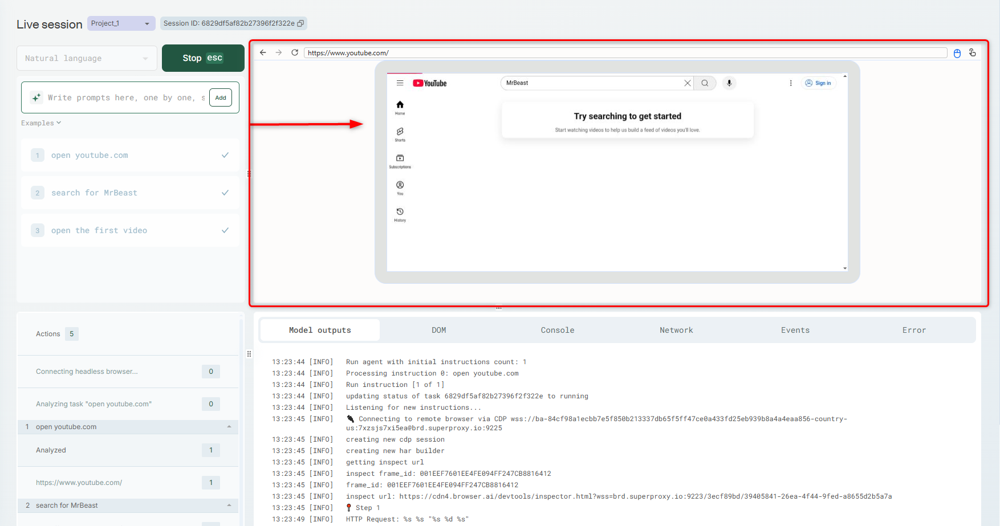
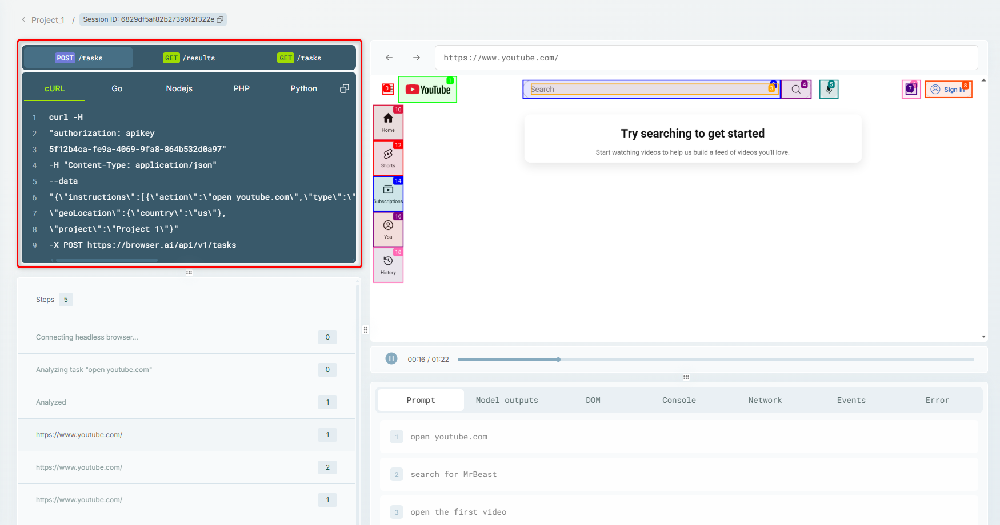

**Browser Use** is the easiest way to connect your AI agents with the browser, offering a powerful yet simple interface for browser automation that makes websites easily accessible for AI-driven tasks.

Whether it's writing in Google Docs, filling out job applications, collecting data, or searching for flights, Browser Use enables seamless interaction with web content.

## How to use it:

### Via API Documentation:
To leverage this capability in your **BrowserAI** tasks, simply set the `engine` parameter to `browser_use` in the [API Reference](https://docs.browser.ai/api-reference/endpoint/tasks) when creating a new task and write an instruction in plain human language — no complex coding required.

### Via Dashboard:
Use **BrowserAI** together with **Browser Use** as explained in the Task API. In addition, to visualize the actions of BrowserAI head to [Playground tab](https://browser.ai/dashboard/page/live/tab/page/live). There you'll be able to choose **Natural Language**, country and add prompts for BrowserAI to perform. Then you can watch how the actions are being done on your right window in live!
<Steps>
  <Step title="Configure Playground">
    Once you go to [Playground tab](https://browser.ai/dashboard/page/live/tab/page/live), ensure it's set to **Natual language**. Choose a country, give it prompts to perform and hit the **Run** button.
    <Frame>
  
</Frame>
  </Step>
  <Step title="Watch Live Session">
    Watch the live session unfold on the right-hand screen as BrowserAI carries out your task!
    <Frame>
  
</Frame>
  </Step>
  <Step title="Watch Results">
    When the task is complete, you'll receive a summary window with a playback video and ready-to-use cURL commands to view the task's metadata and results.
    <Frame>
  
</Frame>
  </Step>
</Steps>