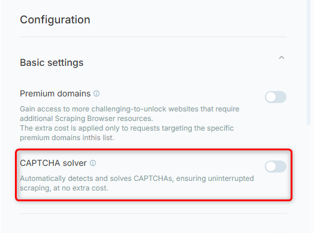

The CAPTCHA solver automatically detects and solves CAPTCHA challenges during scraping at no extra cost, ensuring seamless data extraction. CAPTCHA solving, offering a lightweight, flexible solution for broader scraping scenarios where full automation isn’t required.

Best for:

* Scraping data without getting blocked.

* Emulating real-user behavior for stealthy automation.

* Teams without an unblocking system that want to skip automatic CAPTCHA solving.

## How to enable Captcha Handler
To enable Captcha Handler in your browser.ai project:
1. Go to your [project](https://browser.ai/dashboard/page/projects).
2. Head to **Headless Browser** tab on the right toolbar.
3. Scroll down to Configuration -> Basic settings -> **Captcha Handler**.
<Frame>
  
</Frame>

<Note>
  To manually configure the default CAPTCHA solver using CDP commands, refer to the [**custom CDP functions**](https://docs.brightbrowser.ai/cdp-func/custom) for full control over the solving process
</Note>