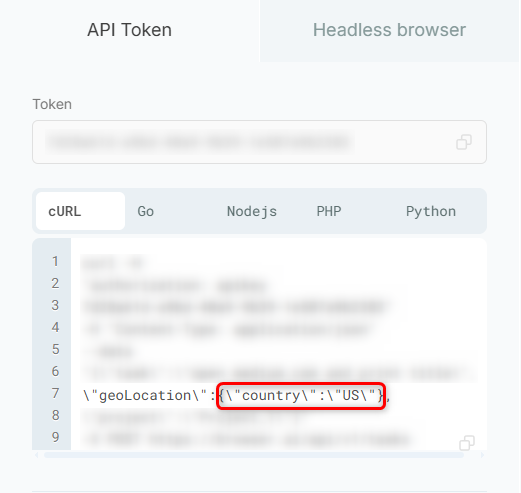
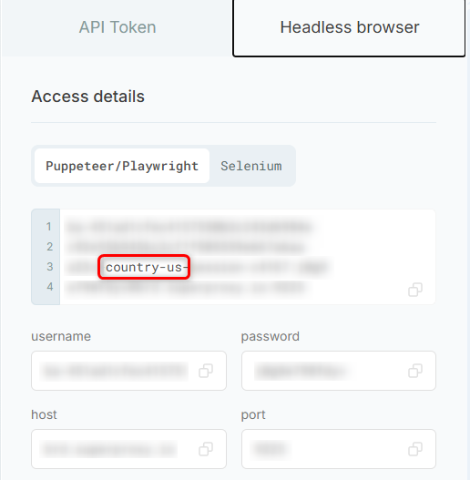

Changing Location feature enables you to dynamically adjust your proxy’s geographic location within a specified region. It’s perfect for geo-targeted data collection, regional content testing, and simulating user behavior from various locations. This ensures accurate scraping, localization testing, and access to location-restricted content across different geographic regions.

There are two available options for changing location:

<Tabs>
  <Tab title="API Token">
    In the **API Token** tab, modify the 2-letter country code within `{"country":"US"}` in the provided cURL command.

    <Frame>
      
    </Frame>
  </Tab>
  <Tab title="Headless Browser">
    In the **Headless Browser** tab, update the 2-letter country code in the command by replacing `country-us` with your desired 2-letter code.

    <Frame>
      
    </Frame>
  </Tab>
</Tabs>