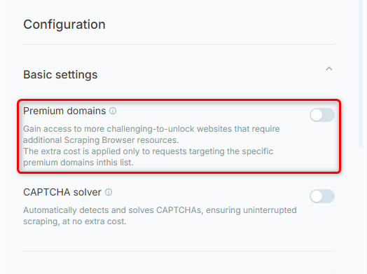

## Activating Premium Domains
To enable premium domains in your browser.ai project:
1. Go to your [project](https://browser.ai/dashboard/page/projects).
2. Go to **Headless Browser** tab on the right toolbar.
3. Scroll down to Configuration -> Basic settings -> **Premium Domains**.

<Frame as="div" style={{width:"50%", height:"auto"}}>
  
</Frame>

## Pricing

* The premium pricing rate will appear in the **Estimated Cost** section upon activation.

* **Only requests to premium domains incur additional charges**, while all others remain at the standard pricing tier.

<Frame as="div" style={{width:"50%", height:"auto"}}>
  
</Frame>

<Note>
  The list below is updated **dynamically**.
</Note>

***

### 🛍️ Retail & E-Commerce

| Domain        | Domain          | Domain        |
| :------------ | :-------------- | :------------ |
| bestbuy.com   | billiger.de     | costco.com    |
| dynos.es      | kroger.com      | lowes.ca      |
| lowes.com     | mediamarkt.de   | mediamarkt.es |
| platt.com     | stopandshop.com | target.com    |
| totalwine.com | walmart.com.mx  | wayfair.com   |

***

### 🥑 Grocery & Food Services

| Domain                    | Domain             | Domain          |
| :------------------------ | :----------------- | :-------------- |
| albertsons.com            | feuvert.fr         | foodlion.com    |
| giantfoodstores.com       | gopuff.com         | instacart.com   |
| realcanadiansuperstore.ca | restaurantguru.com | weismarkets.com |

***

### ✈️ Travel & Hospitality

| Domain         | Domain           | Domain           |
| :------------- | :--------------- | :--------------- |
| agoda.cn       | bestwestern.com  | despegar.com.mx  |
| hermes.com     | hyatt.com        | skyscanner.co.kr |
| skyscanner.net | ticketmaster.com | wizzair.com      |

***

### 📦 Marketplaces & Classifieds

| Domain        | Domain            | Domain               |
| :------------ | :---------------- | :------------------- |
| carousell.com | carousell.com.hk  | carousell.com.my     |
| carousell.ph  | carousell.sg      | cdiscount.com        |
| idealo.de     | peoplefinders.com | searchpeoplefree.com |
| shopee.cl     | shopee.co.id      | shopee.co.th         |
| shopee.com.br | shopee.com.co     | shopee.com.mx        |
| shopee.com.my | shopee.ph         | shopee.sg            |
| shopee.tw     | shopee.vn         | temu.com             |

***

### 🚗 Automotive & Parts

| Domain               | Domain       | Domain         |
| :------------------- | :----------- | :------------- |
| advanceautoparts.com | autozone.com | napaonline.com |

***

### 🏡 Real Estate & Directories

| Domain        | Domain            | Domain               |
| :------------ | :---------------- | :------------------- |
| allpeople.com | familytreenow.com | immobilienscout24.de |
| ingatlan.com  | publicdatausa.com | realestate.com.au    |
