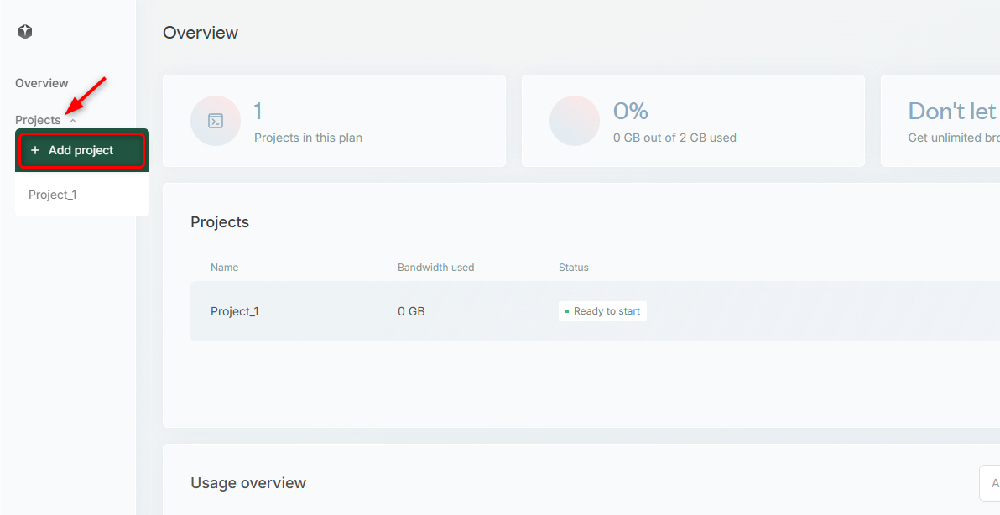
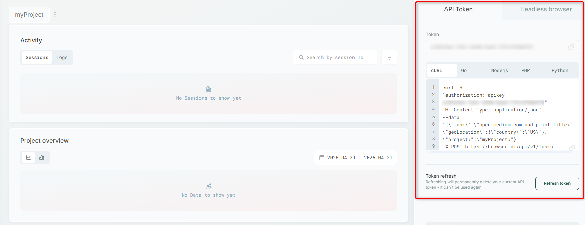
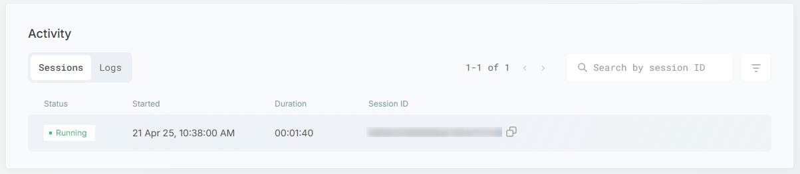
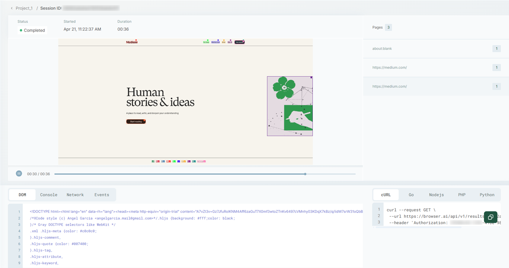

This guide will walk you through setting up **browser.ai** in just a few steps—so you can start automating browser interactions at scale **without dealing with anti-bot measures**.

### Quick Start
<Steps>
  <Step title="Sign up">
    [Sign up](browser.ai) to browser.ai .
  </Step>

  <Step title="Go to Projects">
    Navigate to the **Projects** section on the left sidebar and add a new project.
    <Frame>
  
</Frame>
  </Step>

  <Step title="Name Your Project">
    Inside the project, you can **rename** it to whatever suits your workflow.
    <Frame>
  
</Frame>
  </Step>

  <Step title="Send you first task">
    Your **API token** and a ready-to-use **cURL command** are available in the right sidebar. Here you can customize:
    ```javascript
curl -H "authorization: apikey {YOUR-API-TOKEN}" -H "Content-Type: application/json" --data "{\"task\":\"{YOUR-PROMPT}\", \"geoLocation\":{\"country\":\"{2-LETTER-CODE}\"}, \"project\":\"{PROJECT-NAME}\"}" -X POST https://browser.ai/api/v1/tasks
```
    1. _apikey_ - Your personal API Token
    2. _task_ - the prompt itself.
    3. _country_ - the geolocation of the task, use <Tooltip tip="For example: NO for Norway"><Tooltip tip="This is a tooltip!">Hover over me</Tooltip></Tooltip>.
    <Frame>
  
</Frame>
  </Step>
  <Step title="Session dashboard">
    Once you run the cURL command in your terminal, a new session will appear in your **activity dashboard**.
    <Frame>
  
</Frame>
  </Step>
  <Step title="See results">
    Once the session reaches a **Finalized** status, you can dive in to review the **results** and trace the steps taken by the AI agent.
    <Frame>
  
</Frame>
  </Step>
  <Step title="Use our API">
    Feel free to explore our **API** for quick [task creation](https://docs.browser.ai/api-reference/endpoint/tasks), [metadata retrieval](https://docs.browser.ai/api-reference/endpoint/taskMetadata), and seamless [access to task results](https://docs.browser.ai/api-reference/endpoint/results).
  </Step>
</Steps>