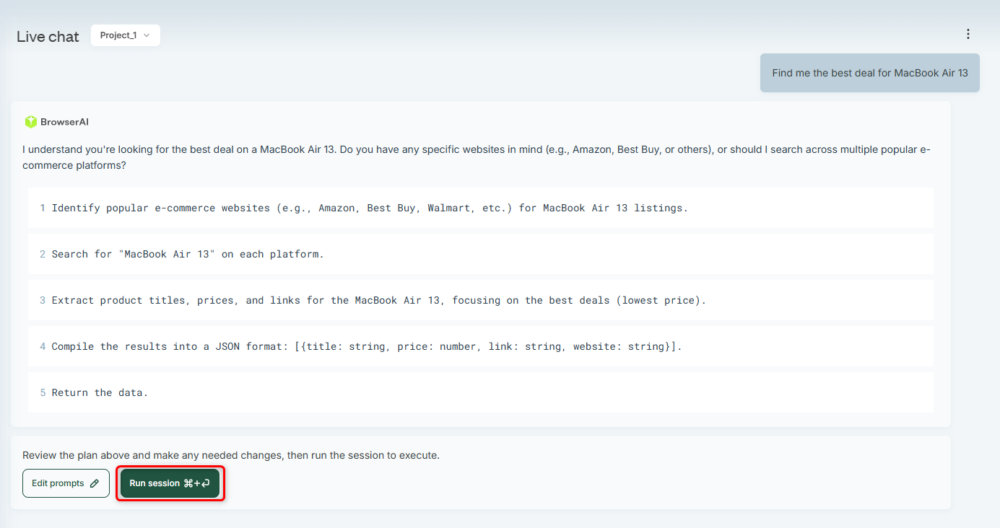

This guide will walk you through launching your first task in **BrowserAI** in just a few steps—so you can start automating browser interactions at scale **without worrying about anti-bot restrictions like fingerprinting, CAPTCHAs, or IP blocks**.

### Quick Start

<Steps>
  <Step title="Sign up">
    [Sign up](https://browser.ai/dashboard/page/projects) to BrowserAI.
  </Step>
  <Step title="Jump to Live chat">
    Navigate to the **Live chat** section on the left sidebar and start a new conversation.

    <Frame>
      
    </Frame>
  </Step>
  <Step title="Send you first task">
    Just say what you're aiming to do, the kind of info you're looking for, or the task you want to complete.

    <Tip>**Be sure to clearly define the task you're looking to accomplish** — providing detailed information will help BrowserAI deliver the most precise and relevant results.</Tip>

    <Frame>
      
    </Frame>
  </Step>
  <Step title="Task break down">
    BrowserAI will split your main task into several smaller sub-tasks to make it easier to achieve.
    You can tweak, remove, or add more sub-tasks as you like. Once you're happy with it, just go ahead and approve it by pressing **Run session**.

    <Frame>
      
    </Frame>
  </Step>
  <Step title="Live session window">
    On your right, you'll find a **live browser window** that shows your session in action and how things are moving along.

    <Frame>
      
    </Frame>
  </Step>
  <Step title="Download results JSON">
    After the task is finished, you'll be able to download a ready-to-use JSON file containing all the parameters and information you requested by pressing **Download JSON**!

    <Frame>
      
    </Frame>
    <Frame>
      
    </Frame>
  </Step>
  <Step title="Use our API">
    Feel free to explore our **API** for quick [task creation](https://docs.browser.ai/api-reference/endpoint/tasks), [metadata retrieval](https://docs.browser.ai/api-reference/endpoint/taskMetadata), and seamless [access to task results](https://docs.browser.ai/api-reference/endpoint/results).
  </Step>
</Steps>